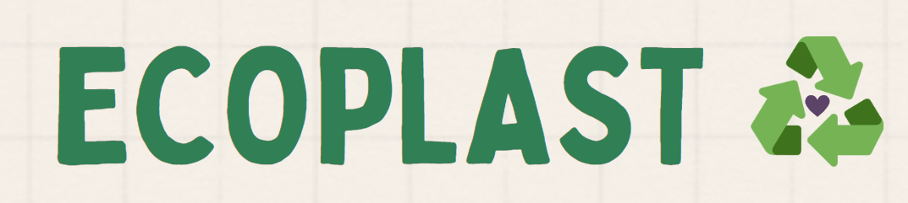

**EcoPlast** é um programa de gestão de plástico reciclável destinado a famílias que vivem em apartamentos. O objetivo principal deste programa é incentivar a reciclagem de plástico, reduzir o impacto ambiental negativo do plástico descartado e recompensar os participantes por suas ações sustentáveis. 

Esta iniciativa está inspirada no trabalho da [*Fundación Botellas de Amor*](https://botellasdeamor.org/co/), que opera na Colombia e em outros paises da América Latina.


### Funcionalidades

- **Gestão de edificios:** Para participar da iniciativa, é preciso cadastrar os predios, antes dos apartamentos. Para isso usamos a classe Building.

```javascript
const Building = require('./Building')

const predio1 = new Building('Reprograma Tower', 'Rua Todas em Tech, 52', 70710280);
```

- **Gestão de Apartamentos:** A partir da confirmação do registro do predio. São criados os apartamentos participantes, na classe Apartment. Posterior a esto, é possível inserir as informações sobre a quantidade de plástico descartado.

```javascript
const Apartment = require('./Apartment')

const predio1_apto1201 = new Apartment(1, 'Yelitza', 1201);
const predio1_apto101 = new Apartment(1, 'Eva', 101);

```

- **Plástico Reciclado:** Funções que validam e convertem o valor do peso na contribuição para a fabricação do RPL.

```javascript

validateWeight(value)
recycledPlastic(weight)

```

## Funcionalidades a serem implementadas

- Desenvolvimento de uma funcionalidade que recompensa o edifício com base na quantidade de plástico reciclado.

- Desenvolvimento do Front-end

## Rodando os testes

Para rodar os testes, rode o seguinte comando

```bash
  npm run test
```

### Tecnologias

  &nbsp;
  &nbsp;

### Autora

[Yelitza López](https://www.github.com/yelalopez)

[](https://www.linkedin.com/in/yelitza-lopez/)

