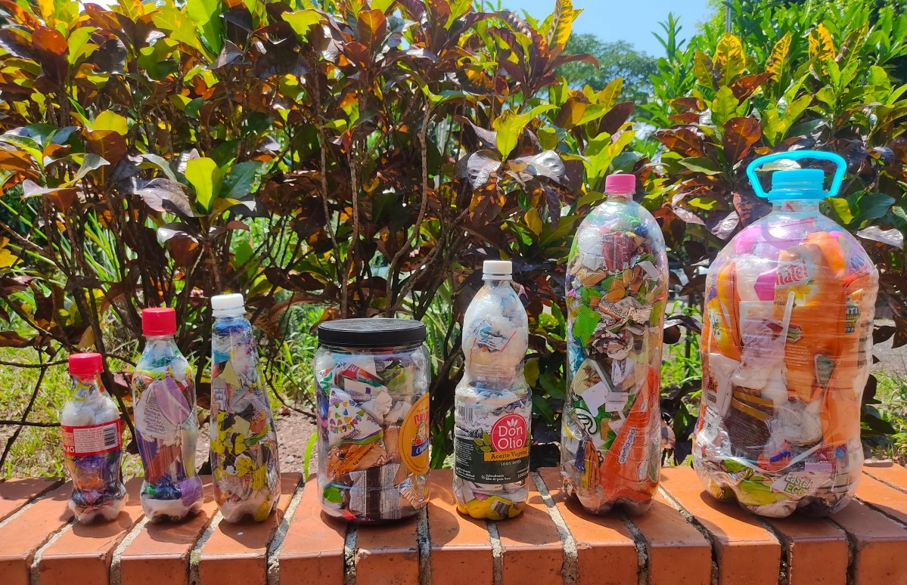
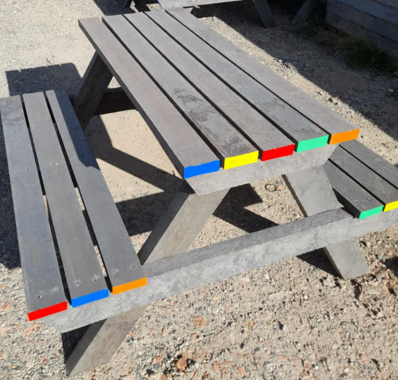
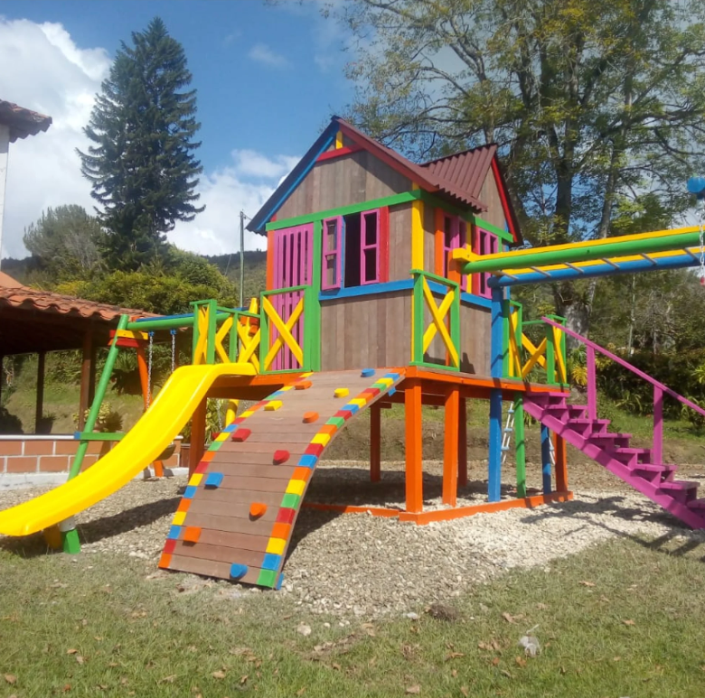

# EcoPlast


**EcoPlast** é um programa de gestão de plástico reciclável destinado a famílias que vivem em apartamentos. O objetivo principal deste programa é incentivar a reciclagem de plástico, reduzir o impacto ambiental negativo do plástico descartado e recompensar os participantes por suas ações sustentáveis. 

Esta iniciativa está inspirada no trabalho da [*Fundación Botellas de Amor*](https://botellasdeamor.org/co/), que opera na Colombia e em outros paises da América Latina.



## Funcionalidades

- **Gestão de edificios:** Aqui são cadastrados os predios participantes da iniciativa.

- **Gestão de Apartamentos:** A partir da confirmação do registro do predio. São criados os apartamentos participantes e as informações sobre a quantidade de plástico descartado.

- **Plástico Reciclado:** Funções que validam e convertem o valor do peso na contribuição para a fabricação do RPL.




## Rodando os testes

Para rodar os testes, rode o seguinte comando

```bash
  npm run test
```


## Autores

- [Yelitza López](https://www.github.com/yelalopez)


## 🔗 Links

[](https://www.linkedin.com/in/yelitza-lopez/)

